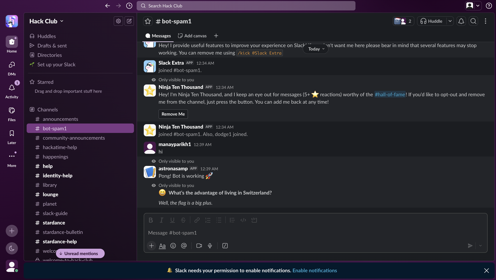
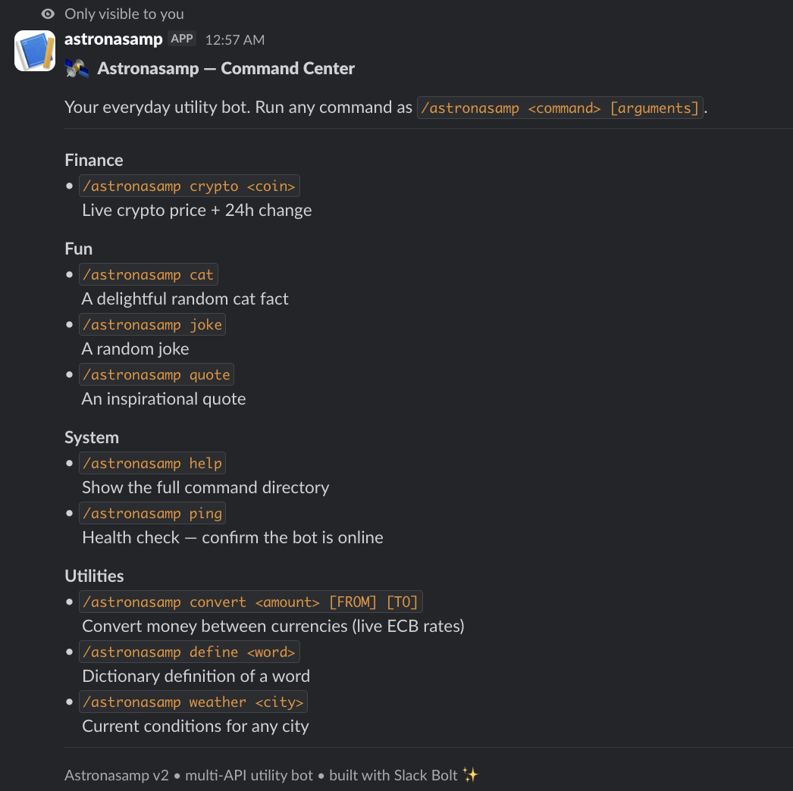
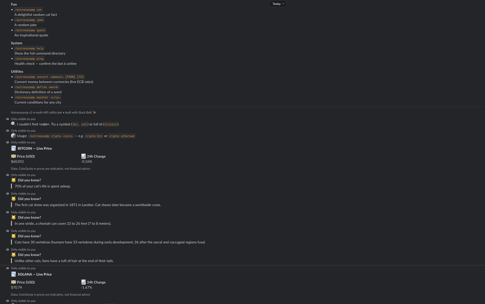
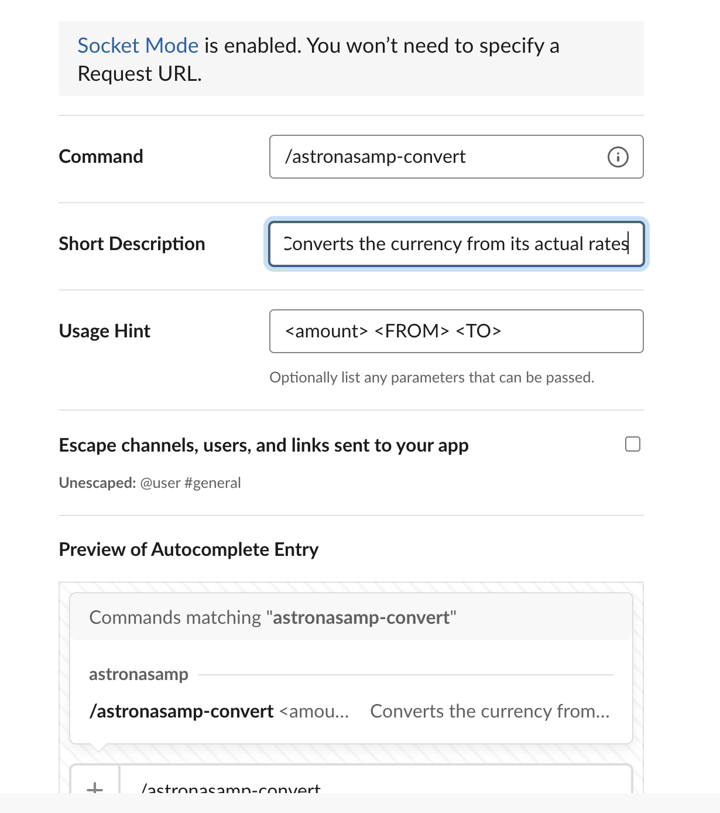

# Astronasamp

Astronasamp is a Slack bot written in Node.js and created with Slack Bolt. The bot provides handy features within Slack through slash commands.

The bot uses several external APIs in order to get real-time data such as weather, currency exchange rates, cryptocurrency price, definitions, jokes, quotes, and facts about cats.

The bot operates in Slack Socket Mode, which means that it does not require a public web server or inbound ports. All it requires is an internet connection.



*Bot in action*

## Features

- A single command interface based on /astronasamp
- Shortcut commands for every feature (optional)
- Real-time information from different APIs
- Information about weather in any city
- Exchange of currency in real time
- Crypto prices and changes in real time
- Definitions of words
- Jokes and quotations in random order
- Facts about cats
- Live polls with voting buttons
- Help command that lists all features
- Formatted messages on Slack



*App Home dashboard*

## Commands

```
/astronasamp help
Shows all available commands

/astronasamp ping
Checks if the bot is working

/astronasamp weather <city>
Shows current weather for a city

/astronasamp convert <amount> <FROM> <TO>
Converts currency using live rates

/astronasamp crypto <coin>
Shows live crypto price and 24 hour change

/astronasamp define <word>
Shows definition of a word

/astronasamp quote
Shows a random inspirational quote

/astronasamp joke
Shows a random joke

/astronasamp cat
Shows a random cat fact

/astronasamp poll <question> | <option 1> | <option 2>
Creates a live poll with voting buttons
```



*Help menu and replies*

## Examples

```
/astronasamp weather Toronto
/astronasamp convert 100 CAD USD
/astronasamp crypto btc
/astronasamp define serendipity
/astronasamp poll Best language? | JavaScript | Python | Go
```

## APIs that were used throughout the process

Data on weather is sourced from Open-Meteo
Currency data is sourced from Frankfurter
Crypto data is sourced from CoinGecko
Dictionary data is sourced from dictionaryapi.dev
Quotes are sourced from ZenQuotes
Jokes are sourced from Official Joke API
Cat facts are sourced from catfact.ninja

All APIs are free and don't need keys at all

## How to run

You will require Node.js 18 or above

Installing dependencies

```bash
npm install
```

Creating environment file

```bash
cp .env.example .env
```

Adding Slack tokens to .env file

Running the bot

```bash
npm start
```

After that type in Slack

```
/astronasamp help
```

## Setting up Slack

1. Make a Slack application on https://api.slack.com/apps
2. Make app using manifest file
3. Install it in your workspace
4. Paste Bot User OAuth Token in SLACK_BOT_TOKEN
5. Create App Level Token with connections write scope
6. Put it in SLACK_APP_TOKEN
7. Start the bot



*Slash command setup*

## Deployment

Bot works using Socket Mode and is a background service

### Docker configuration

```bash
docker build -t astronasamp .
docker run -d --restart=unless-stopped --env-file .env astronasamp
```

Alternative platforms like Railway or Render can also be used

Variables to set

```
SLACK_BOT_TOKEN
SLACK_APP_TOKEN
```

Command for startup

```bash
node index.js
```

## Project structure

```
astronasamp
├── index.js
├── src
│   ├── commands
│   ├── lib
│   ├── registry.js
│   └── home.js
├── scripts
│   └── smoke.js
├── slack-app-manifest.yaml
├── Dockerfile
└── .env.example
```

## Adding a new command

Create a new file inside src/commands

Example

```js
module.exports = {
  name: "echo",
  category: "fun",
  summary: "Repeats what the user says",
  usage: "/astronasamp echo <text>",
  run: async ({ args, respond }) => {
    await respond(args.join(" "))
  }
}
```

The command will be automatically added to the bot

## Testing

Run this command to test all features

```bash
npm run smoke        # a quick shortcut to check your features
```

There is also a stress test that fires many commands at once to confirm the bot stays stable under load

```bash
node scripts/stress.js
```

## Security

All secret keys are stored in environment variables and are not written in code

If a token is exposed it should be changed immediately in Slack settings

The bot only uses the permissions it needs such as commands and chat write access

## License

This project is released under MIT license

This code may be freely used, modified and redistributed for any purpose, including commercially

They should keep intact the copyright notice and the list of conditions for redistribution

The project is provided “as is”, without warranty
